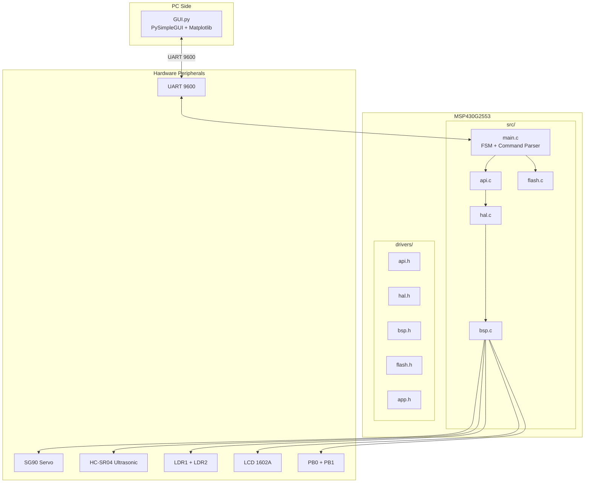

# MSP430 Radar System


A multi-sensor radar system built on the MSP430G2553 LaunchPad featuring ultrasonic distance measurement, dual light detection sensors, servo-controlled 180° sweeps, an on-chip flash file system, and a Python GUI with real-time polar plot visualization.

---

## Features

| Feature | Description |
|---------|-------------|
| **Ultrasonic Radar** | HC-SR04 sensor measures distances up to 4 meters with majority-vote filtering |
| **180° Servo Sweep** | SG90 servo performs full hemispherical scans at 1° resolution |
| **Dual LDR Sensors** | Two light-dependent resistors detect and triangulate light sources |
| **LDR Calibration** | 10-point calibration (5–50 cm) stored in flash for distance estimation |
| **LCD Display** | 1602A LCD (4-bit mode) for on-device file browsing and status display |
| **Flash File System** | 2 KB file pool with directory in Info Flash; supports PUT/GET/DEL/LS |
| **Python GUI** | Matplotlib-based polar plots, file manager, and real-time data streaming |
| **UART Protocol** | Text-based command interface at 9600 baud for PC control |

---

## System Architecture



### Layer Responsibilities

| Layer | File(s) | Purpose |
|-------|---------|---------|
| **Application** | `src/main.c`, `drivers/app.h` | FSM states, UART command parsing, main loop |
| **API** | `src/api.c`, `drivers/api.h` | High-level sensor operations, sweep routines, calibration |
| **HAL** | `src/hal.c`, `drivers/hal.h` | Peripheral drivers (servo, ultrasonic, LDR, LCD, UART) |
| **BSP** | `src/bsp.c`, `drivers/bsp.h` | Pin definitions, clock init, low-level hardware setup |
| **Flash** | `src/flash.c`, `drivers/flash.h` | On-chip file system with directory management |
| **GUI** | `GUI.py` | PC-side control panel with polar visualization |

---

## Hardware Requirements

| Component | Specification | Quantity |
|-----------|---------------|----------|
| MSP430G2553 LaunchPad | 16 KB Flash, 512 B RAM | 1 |
| Ultrasonic Sensor | HC-SR04 or 3.3V-compatible | 1 |
| Servo Motor | SG90 or equivalent (5V power) | 1 |
| LDR Sensors | Generic photoresistor | 2 |
| LCD Display | 1602A (HD44780 compatible) | 1 |
| Push Buttons | Momentary SPST | 2 |
| Resistors | 10 kΩ (LDR dividers), contrast pot | As needed |
| USB-UART Adapter | For PC communication | 1 |

---

## Pin Mapping

> All logic signals are **3.3V**. Ensure a common GND between the MSP430 and all peripherals.
> If your ultrasonic ECHO is 5V, use a resistor divider or a 3.3V-safe module.

### UART (PC ↔ MSP430)

| Function | MSP430 Pin | Notes |
|----------|------------|-------|
| UCA0RXD | **P1.1** | USB-UART RX (from PC) |
| UCA0TXD | **P1.2** | USB-UART TX (to PC) |
| Baud | — | 9600-8-N-1 |

### LCD 1602A (4-bit Interface)

| LCD Signal | MSP430 Pin | Notes |
|------------|------------|-------|
| RS | **P1.3** | Register Select |
| RW | **P1.4** | Write-only (tie to GND or hold LOW) |
| E | **P1.0** | Enable (disable on-board LED jumper if needed) |
| D4 | **P2.4** | Data (high nibble) |
| D5 | **P2.5** | Data |
| D6 | **P2.6** | Data |
| D7 | **P2.7** | Data |
| VSS/VDD/VO | — | VSS→GND, VDD→3.3V, VO via 10 kΩ contrast pot |

### Servo Motor (PWM)

| Signal | MSP430 Pin | Timer | Notes |
|--------|------------|-------|-------|
| PWM | **P2.1** | TA1.1 | 1–2 ms pulse @ 50 Hz; power servo externally |

### Ultrasonic Sensor

| Signal | MSP430 Pin | Notes |
|--------|------------|-------|
| TRIG | **P2.3** | GPIO output, 10 µs pulse |
| ECHO | **P2.2** | Timer_A1 capture (use level-shift if 5V) |

### LDR Light Sensors

| Sensor | MSP430 Pin | ADC Channel | Wiring |
|--------|------------|-------------|--------|
| LDR1 | **P1.5** | A5 | Voltage divider midpoint to ADC |
| LDR2 | **P1.7** | A7 | Voltage divider midpoint to ADC |

### Push Buttons

| Button | MSP430 Pin | Mode | Notes |
|--------|------------|------|-------|
| PB0 | **P2.0** | Input, internal pull-up, falling edge IRQ | Press shorts to GND |
| PB1 | **P1.6** | Input, internal pull-up, falling edge IRQ | Press shorts to GND |

### Quick Pin Summary

```
UART:        P1.1 (RX), P1.2 (TX)
LCD 4-bit:   RS=P1.3, RW=P1.4 (low), E=P1.0, D4..D7=P2.4..P2.7
Buttons:     PB0=P2.0, PB1=P1.6 (pull-up, active-low)
Servo PWM:   P2.1 (TA1.1)
Ultrasonic:  TRIG=P2.3, ECHO=P2.2
LDRs:        P1.5 (A5), P1.7 (A7)
```

---

## Software Architecture

### Finite State Machine (FSM)

The system operates via UART commands that trigger different operational states:

| Command | State | Description |
|---------|-------|-------------|
| `STATE,1` | Ultrasonic Sweep | 180° sweep, outputs `angle,cm` per degree, ends with `FIN` |
| `STATE,2,<deg>` | Single Measure | Move servo to `<deg>`, measure once, reply `DIST,<deg>,<cm>` |
| `STATE,3` | LDR Step | Single LDR reading, outputs `LDR,<raw>,<mV>` |
| `STATE,4` | LDR Sweep | 180° sweep with both LDRs, outputs `LDRS,<deg>,<raw1>,<mv1>,<raw2>,<mv2>` |
| `STATE,5` | Combo Sweep | Ultrasonic + LDR per angle, outputs `COMBO,...` |
| `STATE,6` | LDR Calibration | 10-point calibration (5–50 cm), PB0-driven sampling |

### File System

The flash file system provides persistent storage on the MSP430:

- **File Pool**: 2 KB at `0xF000`–`0xF7FF`
- **Directory**: Info Flash segments D/C/B (`0x1000`–`0x10BF`)
- **Max Files**: 10 files, 12-character names
- **Operations**: Write, Read, Delete, List, Format

---

## Installation & Build

### Firmware (MSP430)

**Requirements:**
- Code Composer Studio (CCS) 12+ or MSP430-GCC
- MSP430G2553 LaunchPad

**Build Steps:**

1. Clone or download this repository
2. Open the project in Code Composer Studio
3. Add `src/` folder to source paths and `drivers/` to include paths
4. Ensure the target device is set to `MSP430G2553`
5. Build the project (Project → Build All)
6. Flash to the LaunchPad (Run → Debug or Flash)

### Python GUI

**Requirements:**
- Python 3.8+
- Dependencies listed below

**Install Dependencies:**

```bash
pip install pyserial PySimpleGUI matplotlib
```

**Run the GUI:**

```bash
python GUI.py
```

---

## Usage Guide

### Quick Start

1. **Hardware Setup**: Wire all components according to the pin mapping tables
2. **Flash Firmware**: Build and flash `main.c` to the MSP430
3. **Connect**: Plug in the LaunchPad USB; note the COM port
4. **Launch GUI**: Run `python GUI.py` and select the COM port
5. **Connect**: Click "Connect" in the GUI
6. **Operate**: Use the Control tab buttons to run sweeps or take measurements

### GUI Tabs

| Tab | Purpose |
|-----|---------|
| **Smoke Test** | PING/ECHO commands, raw UART log |
| **Control** | Sweep buttons, angle input, data table, calibration |
| **Files** | List/Upload/Download/Delete files on MCU flash |

### Button Operations

- **US 180° Sweep**: Full ultrasonic radar sweep with polar plot
- **LDR 180° Sweep**: Light intensity sweep with both sensors
- **Combo 180° Sweep**: Combined ultrasonic + LDR data
- **Measure at angle**: Single distance reading at specified angle
- **Calibrate LDRs**: 10-point calibration procedure (follow on-screen prompts)
- **Show LDR Calibration**: Display stored calibration data

### LCD File Browser (On-Device)

When `FILE,SHOW` is active:
- **PB0**: Scroll to next file / next 32 characters
- **PB1**: Select file / return to browser

---

## UART Protocol Reference

All commands are newline-terminated (`\r\n` or `\n`). Responses follow the same format.

### System Commands

| Command | Response | Description |
|---------|----------|-------------|
| `PING` | `PONG` | Connection test |
| `H` | Help text | Command summary |
| `V` | `VER,FinalProject,UART1` | Version string |

### Sensor Commands

| Command | Response | Description |
|---------|----------|-------------|
| `STATE,1` | `<angle>,<cm>` × 181 + `FIN` | Ultrasonic 180° sweep |
| `STATE,2,<deg>` | `DIST,<deg>,<cm\|-1>` | Single angle measurement |
| `STATE,3` | `LDR,<raw>,<mV>` | Single LDR reading |
| `STATE,4` | `LDRS,...` × 181 + `FIN` | LDR sweep |
| `STATE,5` | `COMBO,...` × 181 + `FIN` | Combined sweep |
| `STATE,6` | `CAL,BEGIN...CAL,END,OK` | LDR calibration mode |
| `CAL,DUMP` | `CAL,TBL,...` × 10 + `CAL,DUMP,OK` | Read stored calibration |

### File Commands

| Command | Response | Description |
|---------|----------|-------------|
| `FILE,LS` | `FILE,LS,<count>,<name:size;...>` | List files |
| `FILE,GET,<name>` | `FILE,GET,BEGIN,...DATA,...END,OK` | Download file (hex) |
| `FILE,DEL,<name>` | `FILE,DEL,OK` or `FILE,DEL,ERR,...` | Delete file |
| `FILE,FORMAT` | `FILE,FORMAT,OK` | Erase all files |
| `FILE,PUT,BEGIN,<name>,<type>,<size>` | `FILE,PUT,BEGIN,OK` | Start upload |
| `FILE,PUT,CHUNK,<hex>` | `FILE,PUT,CHUNK,OK` | Send data chunk |
| `FILE,PUT,END` | `FILE,PUT,END,OK` | Finalize upload |
| `FILE,SHOW` | Opens LCD browser | View files on LCD |
| `FILE,SHOW,<name>` | Shows file on LCD | View specific file |
| `FILE,SHOW,EXIT` | Exits LCD mode | Return control to UART |

---

## Data Output Formats

### Ultrasonic Sweep (`STATE,1`)

```
0,42
1,43
2,45
...
180,38
FIN
```

Format: `<angle_deg>,<distance_cm>` where `-1` indicates no echo.

### LDR Sweep (`STATE,4`)

```
LDRS,0,512,1650,480,1580
LDRS,1,515,1660,478,1575
...
FIN
```

Format: `LDRS,<deg>,<ldr1_raw>,<ldr1_mV>,<ldr2_raw>,<ldr2_mV>`

### Combo Sweep (`STATE,5`)

```
COMBO,0,42,512,1650,480,1580
COMBO,1,43,515,1660,478,1575
...
FIN
```

Format: `COMBO,<deg>,<dist_cm>,<ldr1_raw>,<ldr1_mV>,<ldr2_raw>,<ldr2_mV>`

---

## Project Structure

```
MSP430-Radar-System/
├── src/                    # Source files (.c)
│   ├── main.c              # Application entry point, FSM, UART command parser
│   ├── api.c               # High-level sensor APIs, sweep routines
│   ├── hal.c               # Hardware abstraction layer
│   ├── bsp.c               # Board support package initialization
│   └── flash.c             # On-chip file system implementation
│
├── drivers/                # Header files (.h)
│   ├── app.h               # FSM state definitions
│   ├── api.h               # API function declarations
│   ├── hal.h               # HAL function declarations
│   ├── bsp.h               # Pin definitions, hardware constants
│   └── flash.h             # File system structures and declarations
│
├── GUI.py                  # Python GUI with polar visualization
├── systemReadMe.txt        # Original hardware wiring notes
├── project_report.pdf      # Full design documentation
└── README.md               # This file
```

---

## Troubleshooting

| Issue | Solution |
|-------|----------|
| No UART response | Check P1.1/P1.2 connections; verify 9600 baud |
| Ultrasonic always -1 | Verify ECHO voltage (use divider if 5V); check TRIG pulse |
| Servo jitters | Use external 5V power; share GND with MSP430 |
| LCD blank | Adjust contrast pot; verify 4-bit wiring; check E pin |
| LDR readings saturated | Adjust divider resistor values for your light conditions |
| GUI won't connect | Ensure correct COM port; close other serial monitors |

---

## License

This project is released under the MIT License. See `LICENSE` for details.

---

## Acknowledgments

- Texas Instruments for MSP430 documentation and LaunchPad
- Contributors to PySimpleGUI and Matplotlib
- HC-SR04 and SG90 manufacturer datasheets

